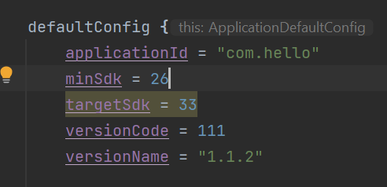

# Android
## Profil
| Variable | Isi |
| -------- | --- |
| **Nama** | Gilar Sumilar |
| **NIM** | 312210407 |
| **Kelas** | TI.22.A4 |
| **Mata Kuliah** | Pemrograman Android |

### Vidio tugas pertemuan 6 : [Sourcecode](https://drive.google.com/drive/folders/1c6yRU-d1Xa0UIBP04TY-FIB7L1xEMNfp)

### UTS Pertemuan 8 
- Menambahkan Fitur Limit & Memberi warna di setiap bilangan genap

**Hasil tugas :**

#### [Sourcecode_Java](https://github.com/GilarSumilar/Android/blob/main/app/src/main/java/com/hello/MainActivity.java)

#### [Sourcecode_Activity](https://github.com/GilarSumilar/Android/blob/main/app/src/main/res/layout/activity_popup.xml)

#### *Note :*
Update Versi dari 1.1.1 - 1.1.2

